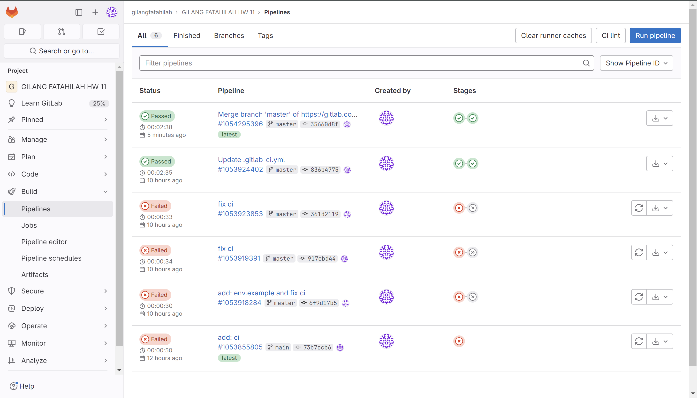

# SIMPLE REST API MOVIES

This is a simply REST API i've been created due my homework on week 11 independen study at Rakamin Academy.
to use this application, you need to install the package first using the following command below on the terminal:

## Install Package

    npm install

## Environment Variables

    Create your own .env file

## Database Migration

    npm run migrate

## Run the app

    npm run start

## Test the app

    npm run test

## Gitlab CI / CD result :

## Authors

- [**Gilang Fatahilah**](https://instagram.com/gilanqf)
